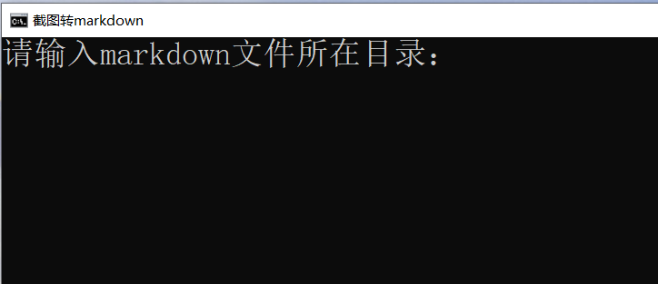
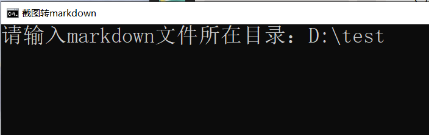
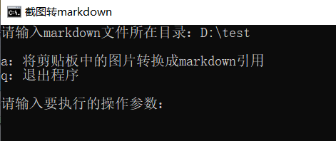
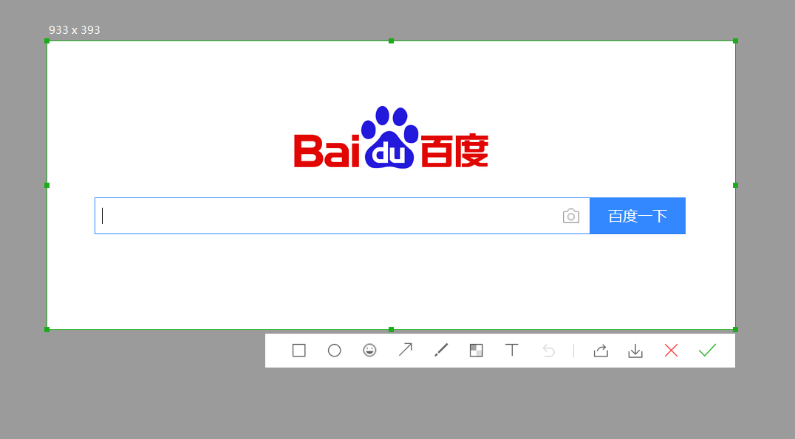
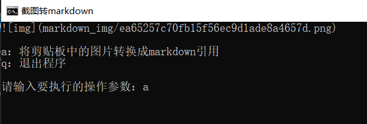
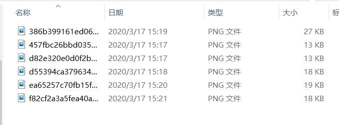

# img_to_markdown

用markdown写东西的时候，插入截图非常麻烦（截图 → 另存为 → 复制图片路径 → 在markdown中引用）

所以我想到了写一个脚本，简化操作

## 使用方法

### 1. 运行脚本

### 2. 输入markdown文件所在的目录

### 3. 进入主页面

### 4. 截图（这里使用微信截图）

### 5. 输入a将剪贴板中的图片转成markdown的引用

图片都保存在了 `markdown_img` 目录下了

### 6. 将输出的字符串复制粘贴到markdown文档中